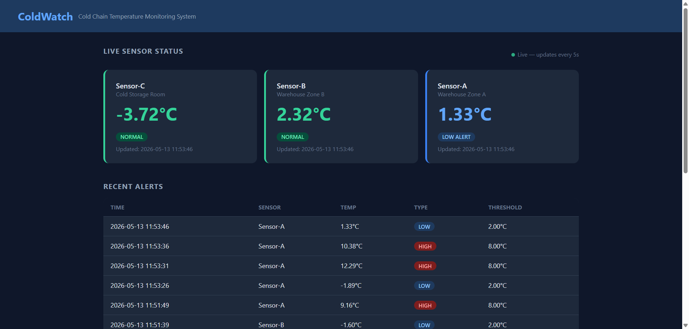

# ColdWatch

> A cloud-based cold chain temperature monitoring system — real-time sensor tracking, automatic breach detection, and instant email alerts via AWS SNS.


---

## Screenshots

<!--  -->

---

## Features

- **Real-time monitoring** — Temperature readings from multiple sensors every 5 seconds
- **Automatic breach detection** — Configurable HIGH/LOW thresholds per sensor
- **Instant email alerts** — AWS SNS delivers notifications the moment a breach is detected
- **Live dashboard** — PHP frontend auto-refreshes via JavaScript without full page reload
- **Role-based access** — Admin and operator roles with session management
- **Fully containerized** — Four Docker services orchestrated with Docker Compose
- **CI pipeline** — GitHub Actions verifies imports, Docker builds, and AWS connectivity on every push

---

## Architecture

ColdWatch follows a microservices architecture with four containerized services:

```
Python Simulator
      │  POST /reading (every 5s)
      ▼
Flask REST API ──── MySQL 8.0
      │                 (temperature_readings, alert_logs, sensors, users)
      │ breach detected
      ▼
  AWS SNS ──── Email Alert
      
PHP Dashboard ──── GET /readings, /alerts (every 5s via JS)
```

| Service | Technology | Role |
|---------|-----------|------|
| `flask-api` | Python 3.11 + Flask | REST API, breach detection, SNS alerts |
| `simulator` | Python 3.11 | Generates sensor readings (10% breach rate) |
| `mysql` | MySQL 8.0 | Stores readings, alerts, sensors, users |
| `php-app` | PHP 8.2 + Apache | Web dashboard with login/logout |

---

## Quick Start

### Prerequisites

- [Docker Desktop](https://www.docker.com/products/docker-desktop/)
- Git
- AWS account with SNS topic configured (for email alerts)

### Installation

```bash
# 1. Clone the repo
git clone https://github.com/kong-pd/coldwatch.git
cd coldwatch

# 2. Set up environment variables
cp .env.example .env
# Edit .env and fill in your AWS credentials and DB passwords

# 3. Start all services
docker compose up --build

# 4. Open the dashboard
# http://localhost:8080
```

### Test Accounts

| Username | Password | Role |
|----------|----------|------|
| `admin` | `admin123` | Admin |
| `operator` | `operator123` | Operator |

---

## Project Structure

```
coldwatch/
├── flask-api/              # REST API (Python/Flask)
│   ├── app.py
│   ├── requirements.txt
│   └── Dockerfile
├── simulator/              # Sensor data simulator (Python)
│   ├── simulator.py
│   └── Dockerfile
├── php-app/                # Web dashboard
│   ├── index.php           # HTML structure (PHP renders shell only)
│   ├── login.php
│   ├── logout.php
│   ├── style.css
│   ├── app.js              # All API calls and DOM updates
│   └── Dockerfile
├── mysql-init/
│   └── init.sql            # Schema + seed data
├── .github/workflows/
│   └── ci.yml              # GitHub Actions CI pipeline
├── docker-compose.yml
├── .env.example            # Environment variable template
└── .env                    # (gitignored — create from .env.example)
```

---

## API Endpoints

| Method | Endpoint | Description |
|--------|----------|-------------|
| `POST` | `/reading` | Receive a sensor reading |
| `GET` | `/readings` | Get latest 50 readings |
| `GET` | `/alerts` | Get latest 20 alerts |
| `POST` | `/login` | Authenticate a user |

---

## AWS SNS Setup

1. Go to [AWS SNS Console](https://console.aws.amazon.com/sns/) → Create topic (Standard)
2. Create a subscription → Protocol: Email → enter your email
3. Confirm the subscription via email
4. Copy the Topic ARN into your `.env` as `SNS_TOPIC_ARN`
5. Create an IAM user with `SNS:Publish` permission and add the credentials to `.env`

---

## License

MIT © [kong-pd](https://github.com/kong-pd)
