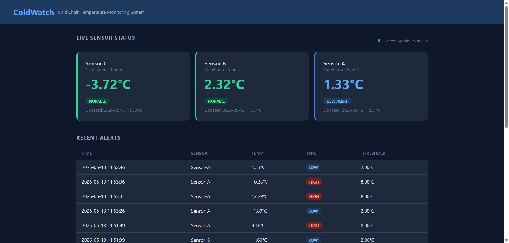

# ColdWatch

Cold chain compliance requires continuous temperature monitoring and breach
logging across food safety and pharmaceutical supply chains. ColdWatch
automates the pipeline — sensor ingestion, threshold detection, and instant
email alerts via AWS SNS.




---

## Architecture

Four Docker services orchestrated with Compose:

```
Python Simulator
      │  POST /reading (every 5s)
      ▼
Flask REST API ──── MySQL 8.0
      │  breach detected
      ▼
  AWS SNS ──── Email alert

PHP Dashboard ──── GET /readings, /alerts (every 5s via JS)
```

| Service | Stack | Role |
|---------|-------|------|
| `flask-api` | Python 3.11 + Flask | REST API, breach detection, SNS publish |
| `simulator` | Python 3.11 | Generates readings every 5s (10% breach rate) |
| `mysql` | MySQL 8.0 | Stores readings, alerts, sensors, users |
| `php-app` | PHP 8.2 + Apache | Dashboard with login/logout |

---

## Setup

Requires Docker Desktop and an AWS account with SNS configured.

```bash
git clone https://github.com/kong-pd/coldwatch.git
cd coldwatch
cp .env.example .env
# Fill in DB passwords and AWS credentials
docker compose up --build
# → http://localhost:8080
```

**Test accounts:**

| Username | Password | Role |
|----------|----------|------|
| `admin` | `admin123` | Admin |
| `operator` | `operator123` | Operator |

---

## AWS SNS setup

1. SNS Console → Create topic (Standard)
2. Create subscription → Protocol: Email → confirm via email
3. Copy Topic ARN → `SNS_TOPIC_ARN` in `.env`
4. IAM → create user with `SNS:Publish` permission → add credentials to `.env`

---

## API endpoints

| Method | Endpoint | Description |
|--------|----------|-------------|
| `POST` | `/reading` | Ingest a sensor reading |
| `GET` | `/readings` | Latest 50 readings |
| `GET` | `/alerts` | Latest 20 alerts |
| `POST` | `/login` | Authenticate user |

---

## Things that will bite you

**MySQL healthcheck** — Flask starts before MySQL is ready without the
`healthcheck` + `depends_on: condition: service_healthy` in
`docker-compose.yml`. Already handled, but don't remove it.

**Simulator URL** — `API_URL` in `simulator.py` uses `flask-api:5000`
(Docker service name). If running the simulator outside Docker for testing,
change it to `localhost:5000`.

**SNS credentials** — Need both the IAM key/secret AND the Topic ARN in
`.env`. Missing either causes a silent fail — breach gets logged to MySQL
but the email never sends.

---

## Project layout

```
coldwatch/
├── flask-api/          app.py, requirements.txt, Dockerfile
├── simulator/          simulator.py, Dockerfile
├── php-app/            index.php, login.php, app.js, style.css, Dockerfile
├── mysql-init/         init.sql (schema + seed data)
├── .github/workflows/  ci.yml
├── docker-compose.yml
└── .env.example
```

---

## License

MIT
